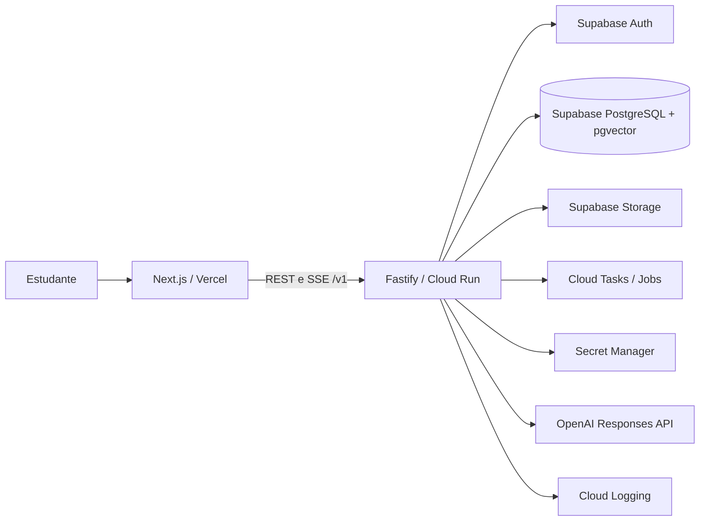

# Iatron EdTech

Plataforma AI First para preparação de provas de residência médica no Brasil. Este repositório contém o bootstrap arquitetural; regras pedagógicas, autenticação, persistência e chamadas de IA ainda não foram implementadas.

## Arquitetura



O navegador acessará somente APIs públicas e recursos permitidos por RLS. Credenciais privilegiadas e chamadas à OpenAI permanecem na API. Nesta fase, as integrações externas aparecem apenas como limites arquiteturais, sem clientes ativos em produção.

## Estrutura

- `apps/web`: Next.js App Router, Tailwind e experiência web em português.
- `apps/api`: Fastify, REST `/v1`, health checks e OpenAPI.
- `packages/ui`: componentes visuais acessíveis compartilhados.
- `packages/contracts`: DTOs, tipos e esquemas Zod compartilhados.
- `packages/config`: utilitários de validação de configuração.
- `packages/database`: fábrica base do cliente Supabase para uso exclusivo do servidor.
- `packages/ai`: fronteira de integração de IA, sem implementação real.
- `packages/observability`: contrato e logger JSON base.
- `packages/eslint-config` e `packages/typescript-config`: padrões do monorepo.

## Requisitos

- Node.js 20.9 ou superior (Node.js 22 recomendado)
- pnpm 10

Ative o pnpm com `corepack enable`, se necessário.

## Desenvolvimento local

```bash
pnpm install
cp apps/api/.env.example apps/api/.env
cp apps/web/.env.example apps/web/.env.local
pnpm dev
```

- Web: `http://localhost:3000`
- API: `http://localhost:8080`
- OpenAPI UI: `http://localhost:8080/docs`
- OpenAPI JSON: `http://localhost:8080/docs/json`

Também é possível executar separadamente com `pnpm dev:web` e `pnpm dev:api`.

## Qualidade e build

```bash
pnpm lint
pnpm typecheck
pnpm test
pnpm build
```

## Variáveis de ambiente

### Web

| Variável              | Obrigatória | Uso                                                          |
| --------------------- | ----------- | ------------------------------------------------------------ |
| `NEXT_PUBLIC_API_URL` | Não         | URL pública da API; padrão local `http://localhost:8080/v1`. |

### API

| Variável    | Obrigatória | Uso                                            |
| ----------- | ----------- | ---------------------------------------------- |
| `NODE_ENV`  | Não         | `development`, `test` ou `production`.         |
| `HOST`      | Não         | Interface de escuta; padrão `0.0.0.0`.         |
| `PORT`      | Não         | Porta fornecida pelo Cloud Run; padrão `8080`. |
| `LOG_LEVEL` | Não         | Nível dos logs estruturados.                   |

As futuras credenciais de Supabase, OpenAI e GCP serão adicionadas somente quando suas integrações forem implementadas e deverão vir de gerenciadores de segredo nos ambientes hospedados.

## Estratégia de ambientes

- **Local:** aplicações executadas via pnpm; serviços externos apontam para projetos de desenvolvimento quando forem adicionados.
- **Preview:** frontend por pull request na Vercel e uma API isolada de homologação no Cloud Run, sem dados de produção.
- **Staging:** ambiente estável para testes integrados, com projeto Supabase e segredos próprios.
- **Produção:** Vercel, Cloud Run e Supabase dedicados; acesso mínimo, logs auditáveis e deploy promovido após validações.

Configurações não secretas são variáveis por ambiente. Segredos ficam no Vercel Environment Variables ou Google Secret Manager, nunca no Git.

## Docker da API

Gere primeiro o lockfile com `pnpm install` e execute na raiz:

```bash
docker build -f apps/api/Dockerfile -t iatron-api .
docker run --rm -p 8080:8080 -e PORT=8080 iatron-api
```

## Decisões arquiteturais

- [ADR 0001 — Fastify](docs/adr/0001-backend-framework.md)
- [ADR 0002 — Vercel, Supabase e GCP](docs/adr/0002-platform-boundaries.md)
