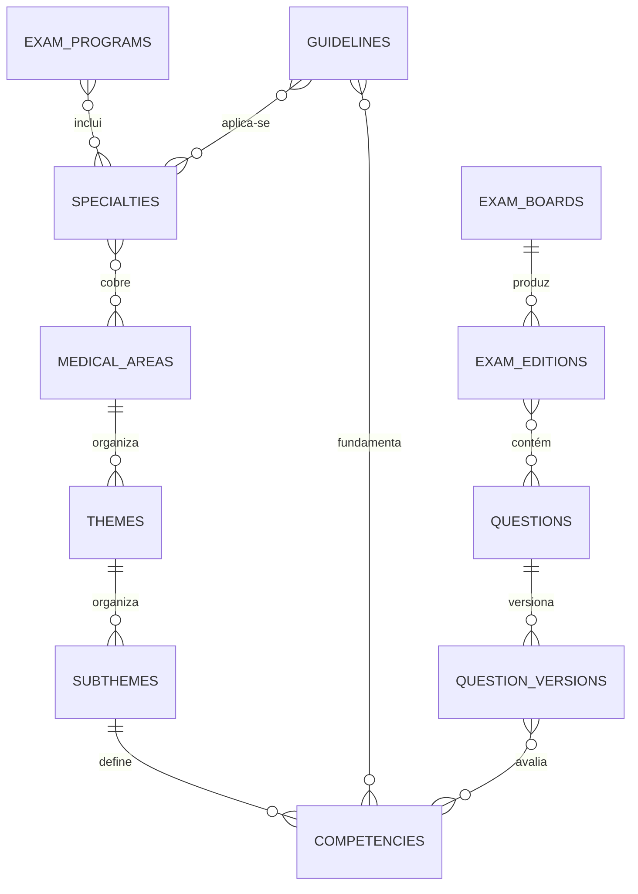

# Modelo acadêmico

O catálogo acadêmico separa identidade, classificação, fonte e ocorrência em prova. A unidade de medição é sempre `competencies`; áreas, temas, subtemas e especialidades são dimensões de navegação e agregação, nunca alvos diretos de mastery.

## Decisões

- Relações programa–especialidade e especialidade–área são N:N.
- `questions` é a identidade estável e possui hash canônico para deduplicação; conteúdo e classificações ficam em `question_versions`.
- `exam_questions` aponta para a questão e fixa a versão efetivamente usada na prova.
- Alternativas, referências, assets, tags, guidelines e classificações são relações próprias, evitando arrays duplicados.
- Dificuldade usa escala numérica validada. Nível cognitivo, modalidade e status são texto deliberadamente evolutivo, sem enums rígidos.
- Guidelines possuem chave estável e versão, permitindo coexistência histórica.
- Catálogos são somente leitura para usuários autenticados; escrita administrativa continua fora do navegador.

## API e inspeção

As consultas autenticadas ficam sob `/v1/academic`: `specialties`, `areas`, `themes`, `competencies`, `boards`, `exams` e `guidelines`. Todas aceitam `limit`, `offset` e `search`.

As páginas `/app/academic/*` consomem esses contratos pela API com o JWT da sessão SSR. O seed é pequeno e serve apenas para validar relações e navegação.
