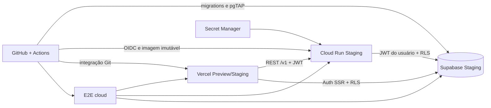

# Arquitetura cloud-first

Staging e produção usam projetos, serviços e credenciais diferentes. O projeto
Supabase `dajdcecjaobdsgatubsb` é o candidato informado para staging; ele só é
usado depois de confirmado como vazio de dados reais. Produção não é criada nem
alterada nesta fase.

Docker Desktop e Supabase local permanecem opcionais para depuração, nunca como
pré-requisito de CI ou aceite. A ordem segura é migration → testes de banco → API
→ frontend → smoke/E2E.
