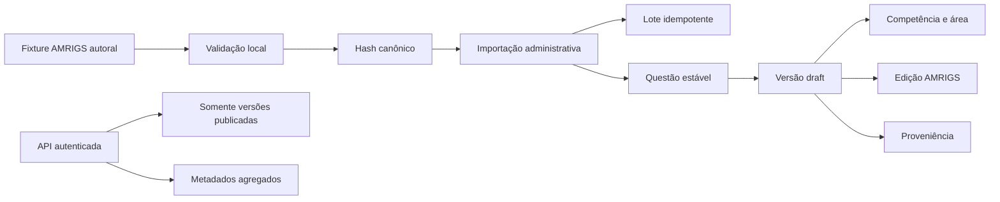

# Content Intelligence MVP — AMRIGS

## Objetivo e limite

Este MVP valida um pipeline ponta a ponta exclusivamente para o programa
AMRIGS. Não implementa outras bancas nem importa questões oficiais.

O fixture versionado é autoral, sintético, não homologado e permanece em
`draft`. Ele existe para validar ingestão, deduplicação, classificação,
proveniência e auditoria. Não pode ser apresentado como questão da AMRIGS ou
conteúdo médico revisado.

## Revisão do modelo existente

O domínio acadêmico já oferecia:

- banca em `exam_boards`;
- processo seletivo em `exam_programs`;
- edição/prova em `exam_editions`;
- composição em `exam_questions`;
- áreas, temas, subtemas e competências;
- identidade estável e hash canônico em `questions`;
- conteúdo versionado em `question_versions`;
- classificação N:N por competência;
- opções e gabarito;
- RLS de leitura e bloqueio de escrita pelo estudante.

As únicas extensões necessárias foram:

- `content_import_batches`: idempotência e auditoria do lote;
- `question_version_provenance`: proveniência editorial e jurídica da versão;
- constraints de estados editoriais;
- `amrigs_content_metadata`: projeção de cobertura do piloto;
- `import_amrigs_content(jsonb)`: importação administrativa atômica.

Não foi criada uma taxonomia paralela.

## Fluxo



## Idempotência e deduplicação

- `import_key` identifica o lote;
- o payload JSONB possui hash SHA-256;
- repetir chave e payload retorna o mesmo lote;
- repetir a chave com payload diferente falha;
- `source_key` impede duplicação na origem;
- `canonical_hash` impede duplicação do mesmo enunciado e alternativas;
- o script rejeita duplicatas dentro do lote;
- a função limita cada lote a 20 questões.

O hash normaliza Unicode, espaços, caixa e ordem de entrada das alternativas.
Ele não substitui revisão editorial de duplicatas semanticamente equivalentes.

## Estados editoriais

Os estados seguem `EDITORIAL_GOVERNANCE.md`:

`draft`, `editorial_review`, `medical_review`, `source_validation`,
`answer_key_validation`, `pending_homologation`, `homologated`, `published`,
`suspended`, `correction_pending`, `superseded` e `rejected`.

O pipeline MVP aceita somente `draft`. A API de questões exige simultaneamente:

- questão `published`;
- versão `published`;
- proveniência `published`;
- vínculo com o programa `AMRIGS`.

O fixture não será retornado pela API de questões.

## Proveniência

Cada versão importada registra origem, fonte, titular, base jurídica,
identificador externo, obtenção, natureza de autoria, responsável, restrições e
histórico de correção. Publicação é bloqueada para natureza editorial não
homologada.

## Pipeline

Pré-requisitos:

- migration aplicada;
- catálogo acadêmico e edição AMRIGS existentes;
- PostgreSQL `psql`;
- `CONTENT_DATABASE_URL` apontando para Supabase autorizado ou banco local.

```bash
CONTENT_DATABASE_URL='postgresql://...' \
  pnpm content:import:amrigs content/amrigs/validation-batch.json
```

O script:

1. restringe a banca à AMRIGS;
2. aceita somente conteúdo autoral de validação;
3. valida estrutura e proveniência;
4. calcula hashes;
5. chama a função administrativa;
6. falha sem gravar parcialmente.

## APIs autenticadas

Mantidas sob `/v1/academic`:

- `GET /boards`;
- `GET /exams`;
- `GET /areas`;
- `GET /competencies`;
- `GET /questions`;
- `GET /content-metadata`.

`questions` retorna apenas conteúdo publicável e inclui prova, banca, área,
competências e proveniência. `content-metadata` informa contagens da edição
AMRIGS, inclusive conteúdo ainda não publicado, sem expor seu enunciado.

## Segurança

- estudantes possuem leitura, nunca escrita;
- a função de importação é exclusiva de `service_role`;
- a função valida que a edição pertence ao programa `AMRIGS`;
- o pipeline não aceita outra banca;
- não há segredo no fixture ou repositório;
- conteúdo draft não é exposto no endpoint de questões.

## Testes

- validação e hash do pipeline em Node;
- rejeição de outra banca, duplicatas e falso status publicado;
- contratos de serialização;
- rotas, autenticação e OpenAPI;
- pgTAP para idempotência, provenance, RLS e metadados.

## Riscos conhecidos

- DEC-001 continua pendente: nenhuma prova oficial foi licenciada;
- revisão médica e responsabilidade editorial continuam pendentes;
- hash canônico não detecta paráfrases;
- PostgREST pode exigir avaliação de performance antes de catálogos maiores;
- contagens da view são adequadas ao MVP, não a importações massivas;
- dados publicados anteriores precisam de migração editorial futura;
- o fixture contém texto clínico sintético e não deve ser usado para estudo.

## Expansão futura

Antes de outra banca:

1. concluir licenciamento e governança editorial;
2. validar o fluxo AMRIGS com conteúdo autorizado;
3. medir volume, erros e tempo de revisão;
4. extrair configuração de banca somente quando surgir a segunda necessidade;
5. adicionar filas e processamento assíncrono apenas quando o volume justificar;
6. avaliar deduplicação semântica como assistência editorial, nunca decisão
   automática;
7. manter os mesmos contratos de proveniência e publicação.
