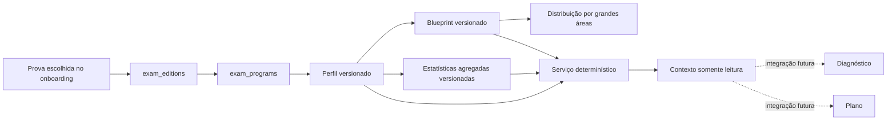

# Exam Intelligence MVP — AMRIGS

## Objetivo e limites

Este MVP cria o contrato determinístico que permitirá contextualizar a
preparação pela prova-alvo. O recorte é exclusivamente AMRIGS e utiliza apenas
metadados já existentes e fixtures sintéticas.

Nenhuma prova oficial foi importada. Nenhuma estatística histórica foi
inferida das duas questões sintéticas do Content Intelligence MVP. O perfil,
blueprint e exemplos agregados permanecem em `draft`, com confiança
`insufficient` e marcação `is_synthetic`.

As decisões DEC-001, DEC-004 e DEC-007 continuam pendentes. Portanto, estes
dados não orientam decisões reais de estudo e não são consumidos pelos
algoritmos atuais.

## Auditoria do modelo

A prova escolhida no onboarding já é armazenada em:

```text
student_target_exams
  → exam_editions
    → exam_programs
      → exam_boards
      → institutions
```

Não havia entidade equivalente a perfil de banca, blueprint, distribuição ou
recorrência estatística. O MVP reutiliza:

- `exam_programs` como raiz do perfil;
- `specialties` como as cinco grandes áreas do blueprint;
- `medical_areas`, `themes`, `subthemes` e `competencies` como dimensões das
  estatísticas;
- `student_target_exams` para resolver o contexto do estudante.

Não foi criada outra seleção de prova ou taxonomia acadêmica.

## Arquitetura



## Entidades e versionamento

### `exam_intelligence_profiles`

Registra programa, nome, versão, vigência, estado editorial, período, amostra,
cobertura, confiança, limitações, fonte, responsáveis editorial e estatístico,
método e atualização.

`(exam_program_id, version)` é único. Um índice parcial permite apenas uma
versão ativa por programa. A seleção exige simultaneamente:

- programa compatível;
- `is_active = true`;
- `valid_from <= data de referência`;
- `valid_until` ausente ou ainda vigente.

Não existe fallback para outra banca ou versão expirada.

### `exam_blueprints` e `exam_blueprint_areas`

O blueprint possui sua própria versão, formato, duração, regra de correção,
fonte, período, confiança e estado. A distribuição referencia as especialidades
existentes, com proporção, quantidade esperada, peso, posição e observação.

O seed adiciona Ginecologia e Obstetrícia e Medicina Preventiva/Saúde Coletiva
às três especialidades já existentes. As cinco proporções de 20% são
exclusivamente sintéticas.

### `exam_recurrence_statistics`

Cada linha referencia exatamente uma dimensão: área, tema, subtema ou
competência. Registra versão, período, tamanho e unidade da amostra,
ocorrências, denominador, cobertura, relevância, confiança, origem, método,
dados ausentes, limitações, responsável estatístico e atualização.

Uma chave gerada normaliza a dimensão e assegura unicidade por perfil, versão e
entidade.

Fixtures sintéticas são impedidas por constraint de declarar confiança ou
relevância superiores a `insufficient`.

## Resolução e explicação

O endpoint de contexto usa o token autenticado para ler somente a prova-alvo do
próprio estudante. O serviço puro:

1. resolve o programa da edição escolhida;
2. seleciona a versão ativa e vigente;
3. carrega o blueprint e as estatísticas;
4. retorna explicações reproduzíveis;
5. informa indisponibilidade sem substituir por outra banca.

O formatter nunca transforma ausência em tendência. Para o fixture atual:

> O perfil atual é demonstrativo e ainda não deve orientar decisões reais de
> estudo.

O adaptador `toPedagogicalExamContext` expõe perfil, versão, distribuição,
evidência, confiança e limitações para integrações futuras. Ele não recalcula
plano, não seleciona questões e não altera estado pedagógico.

## APIs autenticadas

Todas ficam sob `/v1`:

- `GET /exam-intelligence/profiles`;
- `GET /exam-intelligence/profiles/:profileId`;
- `GET /exam-intelligence/profiles/:profileId/blueprint`;
- `GET /exam-intelligence/profiles/:profileId/relevance`;
- `GET /exam-intelligence/context`.

`relevance` aceita opcionalmente `dimensionType` e `dimensionId`, sempre
juntos. O tipo pode ser `large_area`, `area`, `theme`, `subtheme` ou
`competency`.

O contexto indisponível distingue:

- nenhuma prova escolhida;
- prova sem suporte;
- perfil sem versão ativa.

## Dados de desenvolvimento

`supabase/seeds/exam_intelligence_amrigs.sql` contém:

- perfil AMRIGS ativo versão 1;
- perfil AMRIGS inativo versão 2;
- blueprint versão 1;
- cinco distribuições sintéticas;
- exemplos de área, tema, subtema e competência;
- casos com amostra zero e insuficiente.

Os registros usam `synthetic_fixture`, `draft`, `is_synthetic = true` e avisos
explícitos. Não contêm enunciados, gabaritos ou dados históricos oficiais.

## Segurança

- RLS está habilitada nas quatro tabelas;
- somente estudantes autenticados podem ler;
- `anon` não recebe acesso;
- estudantes não recebem permissão de escrita;
- a prova-alvo é resolvida pelo contexto autenticado, sem `user_id` do cliente;
- índices cobrem programa/versão, vigência, perfil/blueprint e dimensões;
- nenhuma credencial ou dado pessoal foi adicionado.

## Performance

Consultas principais:

1. primeira prova-alvo do estudante por `student_target_exams`;
2. perfis do programa ordenados por versão;
3. blueprint ativo e suas cinco áreas;
4. estatísticas do perfil por dimensão.

O benchmark unitário executa 1.000 resoluções determinísticas em memória e
verifica igualdade integral das respostas. O objetivo é detectar regressão
funcional, sem transformar tempo local em SLA.

Para múltiplas bancas, o primeiro risco será o carregamento de todas as
estatísticas do perfil. Paginação ou consulta por dimensão deve ser introduzida
antes de materialização. Uma projeção materializada só se justifica após
medição de volume e latência com conteúdo autorizado.

## Testes

```bash
pnpm format:check
pnpm lint
pnpm typecheck
pnpm test
pnpm build
pnpm db:reset
pnpm db:test
```

Cobertura adicionada:

- contratos e serialização;
- versão ativa, vigência e incompatibilidade;
- confiança e amostra insuficientes;
- ausência de fallback;
- formatter humano;
- determinismo e adaptador;
- autenticação, validação, erros e OpenAPI;
- constraints, FKs, índices, RLS, status e natureza sintética em PgTAP.

Se o Docker Desktop retornar `EOF`, o PgTAP permanece bloqueado e a migration
não pode ser declarada integralmente validada. Para retomar:

```bash
pnpm db:start
pnpm db:reset
pnpm db:test
```

## Integrações futuras

Diagnostic Engine 2.0, plano adaptativo, simulados, métricas e Tutor poderão
consumir apenas o adaptador estável. Antes disso:

1. aprovar AMRIGS como piloto;
2. concluir a decisão jurídica sobre provas;
3. aprovar metodologia estatística e limiares;
4. importar amostra autorizada;
5. revisar e homologar o perfil;
6. substituir o fixture sem alterar os contratos públicos.

Para uma segunda banca, crie programa e perfil próprios, registre versões e
fontes e preserve a resposta de indisponibilidade até existir versão ativa. Não
adicione fallback para AMRIGS.

## Riscos

- licenciamento, banca-piloto e limiares estatísticos continuam pendentes;
- números sintéticos podem ser interpretados como reais se o rótulo for
  removido;
- `draft` demonstrativo é apropriado apenas para desenvolvimento e inspeção;
- a amostra autorizada futura pode exigir revisão do modelo de confiança;
- os tipos gerados do Supabase devem ser regenerados após aplicar a migration;
- nenhum benchmark de banco representa ainda escala com múltiplas bancas.
