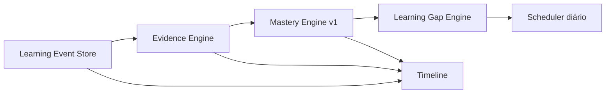

# Learning Engine

O motor pedagógico é determinístico e independente de IA. `learning_events` é a única fonte primária de verdade; evidências e snapshots de mastery são derivados, explicáveis e append-only.

## Algoritmos iniciais

- Evidência `evidence-v1`: preserva competência, evento, peso, dificuldade, tempo, resultado e instante observado.
- Mastery `mastery-v1`: média ponderada do resultado; dificuldade ajusta o peso entre 0,80 e 1,00. Confiança cresce linearmente até cinco evidências. Tendência compara o resultado mais recente às quatro evidências anteriores.
- Gaps: regras explícitas para `critical`, `forgotten` e `low_evidence`, com prioridade normalizada e desempate por código da competência.
- Scheduler: ordena a prioridade e recomenda 20, 30 ou 45 minutos. A mesma entrada e data de referência produzem a mesma saída.

## Persistência e segurança

`record_learning_event` registra eventos idempotentes e deriva evidências e snapshots na mesma transação. Histórico não pode ser atualizado ou removido. Usuários autenticados leem apenas seus próprios dados por RLS e não podem gravar eventos ou mastery diretamente.

As APIs somente leitura ficam em `/v1/learning/{mastery,evidence,gaps,timeline,schedule}`. As páginas de inspeção ficam em `/app/learning/*`.
