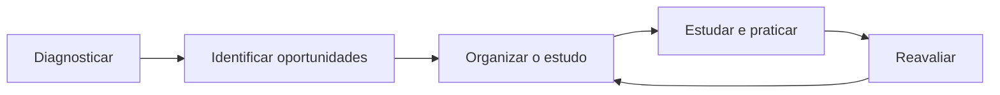

# Iatron — Agent Bootstrap

> Contexto essencial para iniciar uma nova conversa. Este documento orienta a
> entrada no projeto; as fontes normativas continuam sendo os documentos de
> governança e a [Product Bible](./PRODUCT_BIBLE.md).

## O que é o Iatron

O Iatron é uma plataforma educacional para preparação de médicos para provas de
residência no Brasil. Seu propósito é transformar a preparação em uma jornada
orientada: compreender o estudante, identificar necessidades, organizar o
estudo, acompanhar a evolução e ajustar o caminho até a prova.

O produto não presta atendimento médico. Conteúdo clínico precisa de fonte,
proveniência, versão e responsabilidade científica.

## Como funciona

O ciclo central é:

O backend produz as decisões pedagógicas determinísticas. A IA interpreta,
explica e personaliza essas decisões, sem calcular notas, domínio, lacunas ou
plano.

## Arquitetura

O produto possui experiências separadas:

- **Student Workspace:** jornada do estudante.
- **Mentor Workspace:** responsabilidade e revisão científica.
- **Editorial Workspace:** operação do conhecimento.
- **Executive Console:** administração, governança e saúde operacional.

Todas consomem um domínio comum e respeitam limites próprios de acesso. Regras
de negócio pertencem ao backend; a interface apresenta e explica.

## Domínio

A competência é a principal unidade acadêmica. Conteúdos, questões, referências,
blueprints, diagnóstico, plano e acompanhamento devem responder qual competência
medem, ensinam ou exigem.

Especialidades organizam a responsabilidade científica. Mentores Owners
respondem pelo conhecimento de suas áreas dentro das autorizações registradas.
Estados derivados não devem ser duplicados quando puderem ser reconstruídos a
partir das fontes de verdade.

## Jornada

A experiência começa no primeiro acesso, passa pelo onboarding e diagnóstico,
gera uma direção de estudo e acompanha execução, evolução e reavaliação. Cada
tela deve deixar claro:

1. onde o usuário está;
2. por que aquilo importa;
3. o que fazer agora;
4. o que acontece depois.

O produto deve reduzir esforço e ansiedade, sugerir quando houver informação
suficiente e explicar suas recomendações.

## Regras absolutas

- IA não decide regras de negócio nem altera estado pedagógico.
- O motor pedagógico é a fonte das decisões de aprendizagem.
- O frontend não recalcula regras do domínio.
- Identidade e autorização nunca confiam em IDs enviados pelo cliente.
- Nenhum segredo ou dado sensível aparece em código, logs ou respostas.
- Conteúdo médico exige proveniência, versão e governança editorial.
- Métricas devem ser explicáveis; números nunca são inventados pela IA.
- Student, Mentor, Editorial e Admin permanecem isolados por RBAC.
- Toda experiência nasce mobile-first e atende acessibilidade.
- Uma entrega só termina após a Definition of Done e validação em staging.

## Estado atual do projeto

O Iatron possui a infraestrutura principal, autenticação, domínio acadêmico,
motor pedagógico determinístico, diagnóstico, plano adaptativo, Tutor IA
contextual e os quatro workspaces operacionais.

Competências e especialidades estruturam o conhecimento e a responsabilidade
científica. O produto está em estabilização e evolução controlada para uso por
usuários reais. O estado exato de cada iniciativa deve ser confirmado no
repositório, no [Decision Register](./DECISION_REGISTER.md) e no ambiente de
staging antes de qualquer declaração de conclusão.

## Roadmap

O roadmap prioriza qualidade acadêmica, inteligência de conteúdo, profundidade
da experiência do estudante, governança editorial e estabilidade operacional.
Não assuma que uma iniciativa planejada está autorizada ou concluída: confirme
sempre a fonte vigente.

Fontes: [Roadmap Product Vision 4.1](./ROADMAP_PRODUCT_VISION_4_1.md) e
[Product Bible — Roadmap](./PRODUCT_BIBLE.md#13-roadmap).

## Como o agente deve trabalhar

Antes de agir:

1. leia `AGENTS.md`;
2. leia os documentos obrigatórios de governança;
3. confirme o estado do repositório e o escopo autorizado;
4. identifique regras absolutas, riscos e decisões bloqueantes.

Durante o trabalho:

- preserve mudanças existentes;
- faça a menor unidade funcional completa;
- não invente dados, decisões ou autorizações;
- mantenha domínio, IA e apresentação desacoplados;
- valide comportamento real na proporção do risco.

Antes de concluir:

- execute a [Definition of Done](./DEFINITION_OF_DONE.md);
- valide lint, tipagem, testes e build aplicáveis;
- valide RBAC, segurança, acessibilidade e mobile quando afetados;
- publique e faça smoke em staging quando a entrega exigir;
- registre evidências, commit, deploy e estado da working tree.

## Fontes obrigatórias

- [Product Bible](./PRODUCT_BIBLE.md)
- [Product Vision](./PRODUCT_VISION.md)
- [Product Principles](./PRODUCT_PRINCIPLES.md)
- [UX Principles](./UX_PRINCIPLES.md)
- [Voice and Tone](./VOICE_AND_TONE.md)
- [Architectural Principles](./ARCHITECTURAL_PRINCIPLES.md)
- [Definition of Done](./DEFINITION_OF_DONE.md)
- [AI Development Guide](./AI_DEVELOPMENT_GUIDE.md)
