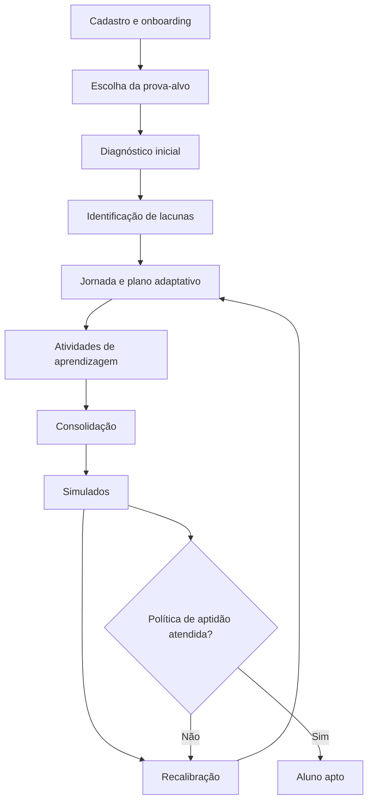
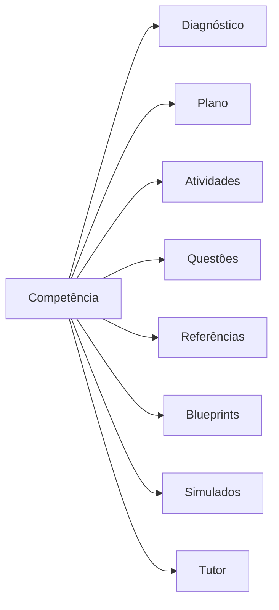
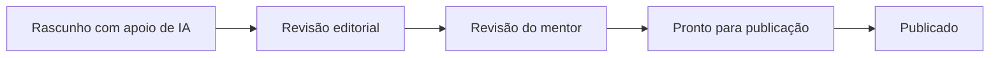

# Constituição do Iatron

## 1. Missão

O Iatron é uma plataforma adaptativa de preparação para provas de residência médica. Sua missão é conduzir o estudante do diagnóstico inicial até um estado mensurável de aptidão para a prova-alvo.

O produto deve reduzir três incertezas:

1. o estudante não sabe o que ainda não domina;
2. não sabe qual é o próximo melhor passo;
3. não consegue transformar estudo irregular em consolidação suficiente.

O resultado principal do produto é aumentar a quantidade de estudantes que alcançam a política vigente de aptidão.

## 2. O que o Iatron é

O Iatron combina:

- escolha de prova-alvo;
- diagnóstico inicial;
- identificação de lacunas;
- jornada personalizada;
- plano adaptativo;
- atividades de aprendizagem;
- consolidação;
- simulados;
- recalibração;
- curadoria científica por médicos mentores;
- política configurável de aptidão.

## 3. O que o Iatron não é

O Iatron não é:

- LMS genérico;
- plataforma de cursos;
- banco de questões isolado;
- CMS médico;
- chatbot médico;
- coleção de dashboards;
- sistema de assistência clínica;
- substituto de médicos mentores;
- sistema em que a IA decide regras pedagógicas.

## 4. Modelo mental oficial

Diagnóstico, plano, atividades, consolidação, simulados, recalibração e aptidão formam um único ciclo. Nenhuma dessas capacidades deve evoluir como produto isolado.

## 5. Unidade acadêmica central

A competência é a principal unidade acadêmica do Iatron.

Todo objeto acadêmico deve responder qual competência mede, ensina, exercita, exige ou consolida.

É proibido criar taxonomias ou modelos de competência paralelos.

## 6. Diagnóstico

O diagnóstico existe para identificar lacunas de aprendizagem relevantes para a prova-alvo. Não existe apenas para produzir uma nota.

O diagnóstico completo deve:

- abranger as grandes áreas exigidas;
- medir competências representativas;
- respeitar blueprint versionado;
- utilizar dificuldade compatível com a banca quando houver base válida;
- declarar insuficiência quando as evidências forem insuficientes;
- permitir pausa e retomada;
- operar em blocos;
- alimentar o plano somente por resultado consolidado.

Triagem rápida e diagnóstico completo são modos distintos. Triagem não pode ser apresentada como diagnóstico profundo.

## 7. Lacunas

Uma lacuna é uma necessidade de aprendizagem sustentada por evidências.

Ela pode decorrer de:

- erro recorrente;
- baixa evidência;
- alta confiança com erro;
- baixa consistência;
- esquecimento;
- desempenho fraco em simulado;
- ausência de cobertura;
- domínio insuficiente em competência relevante.

A IA não cria lacunas.

## 8. Plano adaptativo

O plano responde:

> Qual é o próximo melhor passo de estudo para este estudante?

Ele não é um calendário estático.

Deve considerar de forma determinística:

- lacunas;
- domínio;
- confiança;
- recência;
- tendência;
- relevância para a prova-alvo;
- disponibilidade;
- proximidade da prova;
- atividades já executadas;
- resultados de simulados.

## 9. Atividades e consolidação

Uma atividade deve conter:

- motivo da recomendação;
- competência;
- objetivos;
- conteúdo;
- pontos-chave;
- aplicação em prova;
- erros comuns;
- revisão rápida;
- referências;
- mentor ou área responsável;
- status editorial;
- conclusão explícita.

Abrir a página não conclui a atividade.

Consolidação é o processo de transformar contato inicial em aprendizagem estável por meio de retomadas, revisão, novas questões, variação de dificuldade e reavaliação.

Consolidação não é apenas tempo de estudo.

## 10. Simulados

Os simulados fazem parte do ciclo adaptativo.

Eles servem para:

- medir desempenho em condições próximas da prova;
- gerar novas evidências;
- identificar lacunas residuais;
- validar consolidação;
- recalibrar o plano;
- alimentar a política de aptidão.

O simulado não pode ser uma área desconectada da jornada.

## 11. Política de aptidão

A aptidão é determinada por política configurável, versionada e auditada.

Política inicial do MVP:

- considerar os últimos 3 simulados concluídos;
- calcular a média de acertos;
- considerar apto o estudante com média igual ou superior a 90%.

Esses valores não podem ser hardcoded.

O Admin deve poder alterar:

- quantidade de simulados;
- percentual mínimo;
- vigência;
- justificativa;
- responsável;
- histórico.

Mentores podem recomendar mudanças. Somente Admin autorizado pode ativar nova política.

Nenhum aluno pode ser considerado apto sem satisfazer a política vigente.

## 12. Papel da IA

A IA pode:

- explicar;
- ensinar;
- contextualizar;
- resumir;
- adaptar linguagem;
- dialogar;
- usar contexto produzido pelo backend.

A IA não pode:

- calcular domínio;
- criar lacunas;
- selecionar questões;
- encerrar diagnóstico;
- recalcular plano;
- determinar aptidão;
- alterar estado pedagógico;
- publicar conteúdo médico.

## 13. Modelo acadêmico

### Mentor

O mentor é um médico real responsável pela curadoria científica das áreas sob ownership.

Ele responde por:

- qualidade científica;
- revisão de conteúdos;
- revisão de questões;
- referências;
- atualização científica;
- identificação de lacunas;
- consistência de cobertura;
- validação de versões.

O mentor não publica diretamente e não substitui o Editorial.

### Ownership

Cada especialidade pode possuir:

- um owner principal ativo;
- co-owners autorizados;
- vigência;
- escopo;
- estado;
- histórico.

Mudanças devem ser auditadas.

### Conteúdo

Conteúdo é material didático reutilizável e versionado.

Versões aprovadas ou publicadas são imutáveis. Nova versão exige nova revisão.

### Questões

Questões devem possuir:

- proveniência;
- gabarito validado;
- competência;
- especialidade;
- dificuldade;
- elegibilidade;
- referência;
- status editorial;
- revisão médica.

Questões não são geradas em tempo real para o estudante.

### Referências

Estados mínimos:

- sugerida por IA;
- pendente;
- verificada;
- rejeitada;
- desatualizada.

Referência sugerida pela IA nunca é considerada validada.

### Blueprint

Blueprint representa o perfil versionado de uma prova ou banca e deve registrar áreas, competências, pesos, dificuldade, amostra, confiança, limitações e vigência.

Dados sintéticos devem ser identificados explicitamente.

## 14. Pipeline editorial

Fluxo oficial:

Regras:

- IA produz rascunho, não autoridade;
- editor administra produção e versão;
- mentor responde pela validação científica;
- admin/publicador autorizado realiza publicação;
- o selo “Revisado pelo Mentor” pertence a uma versão específica;
- nova versão não herda aprovação automaticamente;
- e-mail nunca aprova conteúdo diretamente.

## 15. Workspaces

### Student — `/app`

Responsável por:

- jornada;
- diagnóstico;
- plano;
- atividades;
- conteúdo;
- consolidação;
- simulados;
- Tutor;
- perfil.

### Mentor — `/review`

Responsável por:

- visão da área;
- fila;
- comparação de versões;
- preview como aluno;
- conteúdos;
- questões;
- referências;
- lacunas;
- histórico;
- aprovação, ajustes e rejeição.

### Editorial — `/editorial`

Responsável por:

- rascunhos;
- workflow;
- versões;
- atribuição;
- referências;
- questões;
- blueprints;
- auditoria editorial;
- preparação para publicação.

### Admin — `/admin`

Responsável por:

- usuários;
- papéis;
- permissões;
- alunos;
- mentores;
- progresso;
- operação;
- parâmetros;
- política de aptidão;
- auditoria;
- estado da plataforma.

Separação obrigatória:

- Student administra o próprio aprendizado;
- Mentor responde pela qualidade científica;
- Editorial administra produção e workflow;
- Admin governa o negócio, acessos e parâmetros;
- Platform administra infraestrutura.

## 16. Gestão administrativa da aptidão

O Executive Console deve oferecer uma tela para:

- visualizar política vigente;
- alterar últimos N simulados;
- alterar média mínima;
- definir vigência;
- registrar justificativa;
- registrar recomendação de mentores;
- publicar nova versão;
- consultar histórico.

O Admin não pode alterar respostas ou evidências do estudante.

## 17. Arquitetura

- Frontend: Next.js na Vercel.
- Backend: Fastify no Google Cloud Run.
- Banco/Auth: Supabase.
- IA: OpenAI Responses API no backend.
- Monorepo: Turborepo com pnpm.
- Ambiente oficial: https://go.iatron.com.br

Princípio:

> toda lógica pedagógica determinística pertence ao backend.

O frontend apresenta e explica; não recalcula regras.

## 18. Segurança

- RBAC server-side;
- RLS no banco;
- service-role apenas no Cloud Run/Secret Manager;
- nenhum segredo no frontend;
- nenhuma autorização baseada em IDs enviados pelo cliente;
- APIs administrativas protegidas;
- logs sem tokens, cookies, senhas ou payloads sensíveis;
- ações sensíveis auditadas em modelo append-only.

## 19. Design System

O Student Workspace é a baseline visual.

Todos os workspaces reutilizam:

- app shell;
- header;
- navegação;
- drawer mobile;
- perfil;
- logout;
- breadcrumbs;
- tipografia;
- espaçamento;
- cards;
- estados;
- acessibilidade;
- viewport;
- scroll.

É proibido criar Design System ou app shell paralelo.

Todo conteúdo longo deve ser alcançável por scroll natural.

## 20. Observabilidade e release

Requisitos mínimos:

- `x-request-id`;
- logs estruturados e sanitizados;
- códigos de erro seguros;
- `/health`;
- `/ready`;
- `/v1/meta`;
- SHAs de release;
- incident response;
- rollback documentado;
- compatibilidade frontend/API comprovada.

Nenhuma entrega está concluída sem:

- lint;
- typecheck;
- testes;
- contratos;
- build;
- RBAC/RLS quando afetados;
- acessibilidade;
- mobile;
- deploy;
- smoke;
- working tree limpa;
- relatório com evidências.

## 21. Regras absolutas

1. A jornada do estudante é o centro do produto.
2. O objetivo é conduzir o estudante até aptidão mensurável.
3. Competência é a unidade acadêmica central.
4. O backend decide regras pedagógicas.
5. A IA explica; não decide.
6. O frontend não recalcula domínio.
7. Evidência insuficiente deve ser declarada.
8. Triagem não é diagnóstico completo.
9. Mentor real responde pela curadoria científica.
10. Conteúdo médico exige proveniência, versão e revisão.
11. Nova versão exige nova revisão.
12. Student, Mentor, Editorial e Admin têm responsabilidades distintas.
13. Editor não aprova como mentor.
14. Mentor não publica.
15. Admin não altera evidência do estudante.
16. Não criar novo Design System.
17. Não criar novo app shell.
18. Não criar fonte de verdade paralela.
19. Não desativar RLS para simplificar implementação.
20. Não expor service-role.
21. Não usar dados fictícios para preencher dashboards.
22. Não mostrar funcionalidade indisponível como pronta.
23. Não declarar conclusão sem validação em staging.
24. Toda RFC deve declarar quais artigos constitucionais respeita ou altera.
25. Nenhuma nova feature entra no MVP sem relação direta com o ciclo central.

## 22. Fechamento do MVP

Capacidades obrigatórias restantes:

1. política de aptidão configurável;
2. simulados integrados ao ciclo;
3. conteúdo acadêmico suficiente e revisado;
4. consolidação operacional;
5. beta controlado.

Fora do MVP:

- marketplace;
- app nativo;
- ranking público;
- colaboração em tempo real;
- Knowledge Graph completo;
- RAG complexo;
- BI avançado;
- geração automática de conteúdo em produção;
- geração automática de questões em produção;
- probabilidade de aprovação;
- gamificação ampla.

Ordem de execução:

1. auditar aderência do produto atual a esta Constituição;
2. implementar política de aptidão configurável;
3. completar simulados e recalibração;
4. completar conteúdo prioritário;
5. validar consolidação;
6. executar beta fechado;
7. corrigir por evidência real;
8. declarar MVP fechado.
