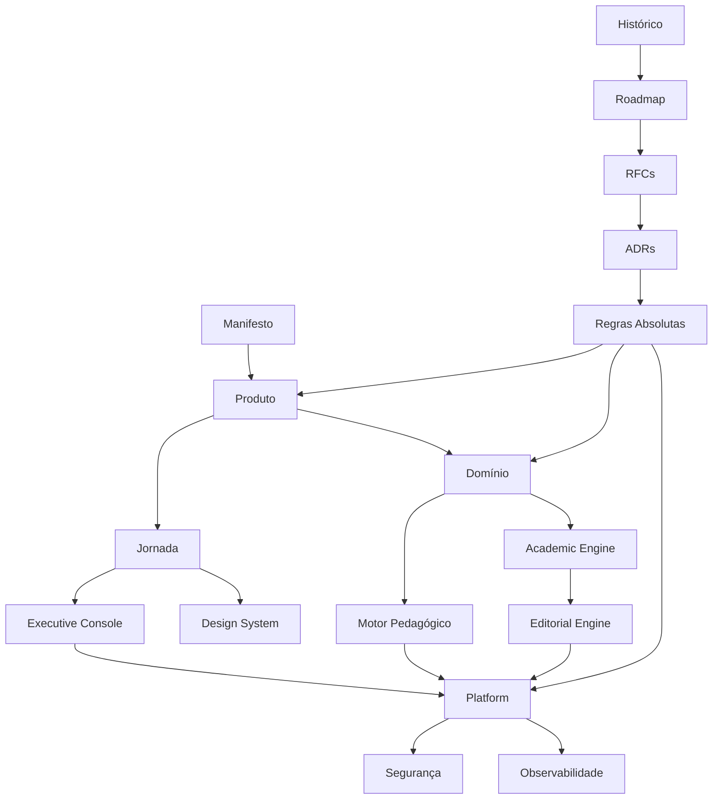
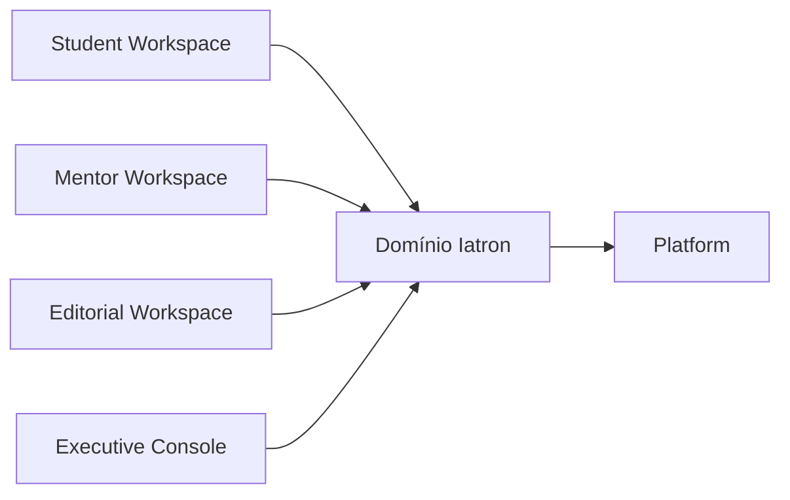
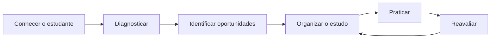

# Iatron Product Bible

> Fundação documental oficial do produto. Este documento define a estrutura
> canônica; seu conteúdo será consolidado de forma incremental, com evidências,
> responsáveis e decisões aprovadas.

## Índice

- [0. Manifesto](#0-manifesto)
- [1. Produto](#1-produto)
- [2. Arquitetura](#2-arquitetura)
- [3. Domínio](#3-domínio)
- [4. Jornada](#4-jornada)
- [5. Motor Pedagógico](#5-motor-pedagógico)
- [6. Academic Engine](#6-academic-engine)
- [7. Editorial Engine](#7-editorial-engine)
- [8. Executive Console](#8-executive-console)
- [9. Platform](#9-platform)
- [10. Segurança](#10-segurança)
- [11. Design System](#11-design-system)
- [12. Observabilidade](#12-observabilidade)
- [13. Roadmap](#13-roadmap)
- [14. Regras Absolutas](#14-regras-absolutas)
- [15. Como agentes devem trabalhar](#15-como-agentes-devem-trabalhar)
- [16. Glossário](#16-glossário)
- [17. ADRs](#17-adrs)
- [18. RFCs](#18-rfcs)
- [19. Histórico](#19-histórico)

## Mapa da documentação

---

## 0. Manifesto

- **Objetivo:** registrar a razão de existir do Iatron e sua promessa central.
- **Escopo:** propósito, visão de futuro e compromisso com o estudante.
- **Responsáveis:** Founder e liderança de Produto.
- **Estado:** estrutura criada — conteúdo pendente de aprovação.
- **Dependências:** nenhuma.
- **Referências:** [Product Vision](./PRODUCT_VISION.md), [Product Principles](./PRODUCT_PRINCIPLES.md).
- **Links internos:** [Produto](#1-produto), [Regras Absolutas](#14-regras-absolutas).

### Estrutura prevista

- [ ] Propósito
- [ ] Problema que o produto resolve
- [ ] Promessa ao estudante
- [ ] Limites éticos e educacionais

## 1. Produto

- **Objetivo:** consolidar a definição do produto, público e proposta de valor.
- **Escopo:** usuários, necessidades, resultados e posicionamento.
- **Responsáveis:** Produto, Founder e Pesquisa.
- **Estado:** estrutura criada — consolidação pendente.
- **Dependências:** [Manifesto](#0-manifesto).
- **Referências:** [Product Vision](./PRODUCT_VISION.md), [UX Principles](./UX_PRINCIPLES.md).
- **Links internos:** [Jornada](#4-jornada), [Roadmap](#13-roadmap), [Glossário](#16-glossário).

### Estrutura prevista

- [ ] Públicos e necessidades
- [ ] Proposta de valor
- [ ] Capacidades do produto
- [ ] Critérios de sucesso
- [ ] Limites de escopo

## 2. Arquitetura

- **Objetivo:** organizar a visão arquitetural do sistema e seus limites.
- **Escopo:** contextos, responsabilidades, integrações e decisões estruturais.
- **Responsáveis:** Staff Engineering e Architecture.
- **Estado:** estrutura criada — detalhes técnicos pendentes.
- **Dependências:** [Produto](#1-produto), [Regras Absolutas](#14-regras-absolutas).
- **Referências:** [Architectural Principles](./ARCHITECTURAL_PRINCIPLES.md), [ADRs](#17-adrs).
- **Links internos:** [Domínio](#3-domínio), [Platform](#9-platform), [Segurança](#10-segurança).

### Estrutura prevista

- [ ] Visão de contexto
- [ ] Limites entre experiências
- [ ] Fluxos de informação
- [ ] Integrações externas
- [ ] Restrições arquiteturais

## 3. Domínio

- **Objetivo:** definir o vocabulário e os agregados centrais do Iatron.
- **Escopo:** entidades acadêmicas, pedagógicas, editoriais e operacionais.
- **Responsáveis:** Domain Owners, Produto e Staff Engineering.
- **Estado:** estrutura criada — mapa detalhado pendente.
- **Dependências:** [Produto](#1-produto), [Arquitetura](#2-arquitetura).
- **Referências:** [Architectural Principles](./ARCHITECTURAL_PRINCIPLES.md), [Decision Register](./DECISION_REGISTER.md).
- **Links internos:** [Motor Pedagógico](#5-motor-pedagógico), [Academic Engine](#6-academic-engine), [Glossário](#16-glossário).

### Estrutura prevista

- [ ] Mapa de contextos
- [ ] Entidades canônicas
- [ ] Competência como eixo acadêmico
- [ ] Especialidade e responsabilidade científica
- [ ] Estados derivados e fontes de verdade

## 4. Jornada

- **Objetivo:** documentar a experiência do estudante do primeiro acesso à prova.
- **Escopo:** etapas, transições, momentos de valor e recuperação de falhas.
- **Responsáveis:** Produto, UX e Pedagogia.
- **Estado:** estrutura criada — narrativa consolidada pendente.
- **Dependências:** [Produto](#1-produto), [Domínio](#3-domínio).
- **Referências:** [UX Principles](./UX_PRINCIPLES.md), [Voice and Tone](./VOICE_AND_TONE.md).
- **Links internos:** [Design System](#11-design-system), [Motor Pedagógico](#5-motor-pedagógico).

### Estrutura prevista

- [ ] Primeiro acesso
- [ ] Onboarding
- [ ] Diagnóstico
- [ ] Plano e execução
- [ ] Reavaliação
- [ ] Mentoria e acompanhamento

## 5. Motor Pedagógico

- **Objetivo:** estruturar a documentação das decisões pedagógicas determinísticas.
- **Escopo:** eventos, evidências, domínio, lacunas, agenda e evolução.
- **Responsáveis:** Pedagogia, Data/Analytics e Staff Engineering.
- **Estado:** estrutura criada — especificações pendentes.
- **Dependências:** [Domínio](#3-domínio), [Academic Engine](#6-academic-engine).
- **Referências:** [Architectural Principles](./ARCHITECTURAL_PRINCIPLES.md), [Statistical Governance](./STATISTICAL_GOVERNANCE.md).
- **Links internos:** [Jornada](#4-jornada), [Regras Absolutas](#14-regras-absolutas).

### Estrutura prevista

- [ ] Fontes de evidência
- [ ] Decisões pedagógicas
- [ ] Explicabilidade
- [ ] Versionamento
- [ ] Limites da IA

## 6. Academic Engine

- **Objetivo:** organizar a inteligência acadêmica centrada em competências.
- **Escopo:** taxonomia, provas, questões, conteúdos, referências e cobertura.
- **Responsáveis:** Academic Domain Owner, Editorial e Mentores Owners.
- **Estado:** estrutura criada — catálogo detalhado pendente.
- **Dependências:** [Domínio](#3-domínio).
- **Referências:** [Editorial Governance](./EDITORIAL_GOVERNANCE.md), [Content Provenance](./CONTENT_PROVENANCE_POLICY.md).
- **Links internos:** [Editorial Engine](#7-editorial-engine), [Motor Pedagógico](#5-motor-pedagógico).

### Estrutura prevista

- [ ] Competências
- [ ] Especialidades
- [ ] Provas e blueprints
- [ ] Conteúdos e questões
- [ ] Referências e proveniência
- [ ] Cobertura acadêmica

## 7. Editorial Engine

- **Objetivo:** estruturar a governança e o ciclo de vida do conhecimento.
- **Escopo:** pauta, produção, revisão, homologação, publicação e atualização.
- **Responsáveis:** Editorial, Mentores Owners e Governança Científica.
- **Estado:** estrutura criada — workflows detalhados pendentes.
- **Dependências:** [Academic Engine](#6-academic-engine), [Segurança](#10-segurança).
- **Referências:** [Editorial Governance](./EDITORIAL_GOVERNANCE.md), [Mentor Governance](./MENTOR_GOVERNANCE.md).
- **Links internos:** [Executive Console](#8-executive-console), [Observabilidade](#12-observabilidade).

### Estrutura prevista

- [ ] Papéis e responsabilidades
- [ ] Estados editoriais
- [ ] Critérios de publicação
- [ ] Atualização científica
- [ ] Auditoria e proveniência

## 8. Executive Console

- **Objetivo:** definir a visão operacional e executiva do produto.
- **Escopo:** administração, governança, saúde, acesso e indicadores.
- **Responsáveis:** Operações, Administração e Platform.
- **Estado:** estrutura criada — catálogo operacional pendente.
- **Dependências:** [Arquitetura](#2-arquitetura), [Observabilidade](#12-observabilidade).
- **Referências:** [RACI Matrix](./RACI_MATRIX.md), [Security](#10-segurança).
- **Links internos:** [Platform](#9-platform), [Roadmap](#13-roadmap).

### Estrutura prevista

- [ ] Visão executiva
- [ ] Usuários e acessos
- [ ] Operação acadêmica
- [ ] Saúde da plataforma
- [ ] Auditoria

## 9. Platform

- **Objetivo:** organizar as capacidades transversais que sustentam o produto.
- **Escopo:** ambientes, entrega, integrações, disponibilidade e continuidade.
- **Responsáveis:** Platform Engineering e SRE.
- **Estado:** estrutura criada — inventário técnico pendente.
- **Dependências:** [Arquitetura](#2-arquitetura), [Segurança](#10-segurança).
- **Referências:** [Architectural Principles](./ARCHITECTURAL_PRINCIPLES.md), [ADRs](#17-adrs).
- **Links internos:** [Observabilidade](#12-observabilidade), [Histórico](#19-histórico).

### Estrutura prevista

- [ ] Ambientes
- [ ] Serviços da plataforma
- [ ] Entrega e promoção
- [ ] Resiliência
- [ ] Continuidade operacional

## 10. Segurança

- **Objetivo:** centralizar princípios, responsabilidades e critérios de segurança.
- **Escopo:** identidade, autorização, dados, segredos, auditoria e riscos.
- **Responsáveis:** Security Owner, Platform e Domain Owners.
- **Estado:** estrutura criada — controles detalhados pendentes.
- **Dependências:** [Arquitetura](#2-arquitetura), [Domínio](#3-domínio).
- **Referências:** [Definition of Done](./DEFINITION_OF_DONE.md), [Architectural Principles](./ARCHITECTURAL_PRINCIPLES.md).
- **Links internos:** [Platform](#9-platform), [Observabilidade](#12-observabilidade).

### Estrutura prevista

- [ ] Modelo de ameaças
- [ ] Identidade e autorização
- [ ] Proteção de dados
- [ ] Gestão de segredos
- [ ] Resposta a incidentes

## 11. Design System

- **Objetivo:** estruturar a linguagem visual e comportamental do Iatron.
- **Escopo:** fundamentos, padrões de interação, acessibilidade e governança.
- **Responsáveis:** Product Design e Frontend.
- **Estado:** estrutura criada — catálogo visual fora desta fundação.
- **Dependências:** [Produto](#1-produto), [Jornada](#4-jornada).
- **Referências:** [UX Principles](./UX_PRINCIPLES.md), [Design Review Checklist](./DESIGN_REVIEW_CHECKLIST.md).
- **Links internos:** [Glossário](#16-glossário), [Regras Absolutas](#14-regras-absolutas).

### Estrutura prevista

- [ ] Princípios
- [ ] Linguagem e tom
- [ ] Padrões de interação
- [ ] Acessibilidade
- [ ] Governança e evolução

## 12. Observabilidade

- **Objetivo:** organizar como o produto mede saúde, uso e falhas.
- **Escopo:** eventos, logs, métricas, rastreabilidade, alertas e incidentes.
- **Responsáveis:** SRE, Platform e Product Analytics.
- **Estado:** estrutura criada — taxonomia detalhada pendente.
- **Dependências:** [Platform](#9-platform), [Segurança](#10-segurança).
- **Referências:** [Definition of Done](./DEFINITION_OF_DONE.md), [Code Review Guidelines](./CODE_REVIEW_GUIDELINES.md).
- **Links internos:** [Executive Console](#8-executive-console), [Histórico](#19-histórico).

### Estrutura prevista

- [ ] Sinais técnicos
- [ ] Eventos de produto
- [ ] Rastreabilidade
- [ ] Alertas
- [ ] Incidentes e aprendizado

## 13. Roadmap

- **Objetivo:** consolidar a direção de evolução do produto.
- **Escopo:** horizontes, resultados, dependências e critérios de entrada/saída.
- **Responsáveis:** Founder, Produto e Engenharia.
- **Estado:** estrutura criada — priorização vigente permanece nas fontes oficiais.
- **Dependências:** [Produto](#1-produto), [Histórico](#19-histórico).
- **Referências:** [Roadmap Product Vision 4.1](./ROADMAP_PRODUCT_VISION_4_1.md), [Decision Register](./DECISION_REGISTER.md).
- **Links internos:** [RFCs](#18-rfcs), [ADRs](#17-adrs).

### Estrutura prevista

- [ ] Agora
- [ ] Próximo
- [ ] Futuro
- [ ] Dependências bloqueantes
- [ ] Critérios de promoção

## 14. Regras Absolutas

- **Objetivo:** reunir invariantes que nenhuma entrega pode violar.
- **Escopo:** produto, pedagogia, IA, domínio, segurança e experiência.
- **Responsáveis:** Architecture, Produto e Governança.
- **Estado:** estrutura criada — regras permanecem normativas nas fontes referenciadas.
- **Dependências:** [Manifesto](#0-manifesto), [ADRs](#17-adrs).
- **Referências:** [Architectural Principles](./ARCHITECTURAL_PRINCIPLES.md), [Product Principles](./PRODUCT_PRINCIPLES.md).
- **Links internos:** [Como agentes devem trabalhar](#15-como-agentes-devem-trabalhar), [Segurança](#10-segurança).

### Estrutura prevista

- [ ] Fonte das decisões pedagógicas
- [ ] Limites da IA
- [ ] Regras de domínio
- [ ] Segurança e privacidade
- [ ] Experiência e acessibilidade

## 15. Como agentes devem trabalhar

- **Objetivo:** definir o protocolo permanente para agentes humanos e artificiais.
- **Escopo:** leitura, planejamento, execução, validação e entrega.
- **Responsáveis:** Staff Engineering e Product Governance.
- **Estado:** estrutura criada — protocolo vigente nas referências.
- **Dependências:** [Regras Absolutas](#14-regras-absolutas), [Definition of Done](./DEFINITION_OF_DONE.md).
- **Referências:** [AI Development Guide](./AI_DEVELOPMENT_GUIDE.md), [Code Review Guidelines](./CODE_REVIEW_GUIDELINES.md).
- **Links internos:** [ADRs](#17-adrs), [RFCs](#18-rfcs), [Histórico](#19-histórico).

### Estrutura prevista

- [ ] Contexto obrigatório
- [ ] Escopo e menor mudança
- [ ] Evidências e testes
- [ ] Segurança operacional
- [ ] Critérios de conclusão

## 16. Glossário

- **Objetivo:** manter um vocabulário único e compreensível.
- **Escopo:** termos de produto, domínio, pedagogia, editorial e plataforma.
- **Responsáveis:** Product Operations e Domain Owners.
- **Estado:** estrutura criada — termos pendentes de consolidação.
- **Dependências:** [Produto](#1-produto), [Domínio](#3-domínio).
- **Referências:** todos os capítulos desta Bible.
- **Links internos:** [Academic Engine](#6-academic-engine), [Motor Pedagógico](#5-motor-pedagógico).

### Estrutura prevista

| Termo         | Definição oficial | Contexto    | Fonte       | Estado   |
| ------------- | ----------------- | ----------- | ----------- | -------- |
| _Placeholder_ | _A definir_       | _A definir_ | _A definir_ | Pendente |

## 17. ADRs

- **Objetivo:** indexar decisões arquiteturais duradouras.
- **Escopo:** contexto, decisão, consequências e substituições.
- **Responsáveis:** Architecture e autores de cada decisão.
- **Estado:** estrutura criada — inventário pendente.
- **Dependências:** [Arquitetura](#2-arquitetura), [Regras Absolutas](#14-regras-absolutas).
- **Referências:** `docs/adr/`.
- **Links internos:** [RFCs](#18-rfcs), [Histórico](#19-histórico).

### Índice previsto

| ADR           | Decisão | Estado   | Substitui | Link |
| ------------- | ------- | -------- | --------- | ---- |
| _A catalogar_ | —       | Pendente | —         | —    |

## 18. RFCs

- **Objetivo:** indexar propostas relevantes antes de decisões irreversíveis.
- **Escopo:** problema, alternativas, impactos, validação e decisão.
- **Responsáveis:** autor da proposta e revisores designados.
- **Estado:** estrutura criada — processo de catalogação pendente.
- **Dependências:** [Roadmap](#13-roadmap), [ADRs](#17-adrs).
- **Referências:** [Code Review Guidelines](./CODE_REVIEW_GUIDELINES.md), [Decision Register](./DECISION_REGISTER.md).
- **Links internos:** [Como agentes devem trabalhar](#15-como-agentes-devem-trabalhar), [Histórico](#19-histórico).

### Índice previsto

| RFC           | Proposta | Responsável | Estado   | Link |
| ------------- | -------- | ----------- | -------- | ---- |
| _A catalogar_ | —        | —           | Pendente | —    |

## 19. Histórico

- **Objetivo:** preservar a evolução verificável do produto e desta Bible.
- **Escopo:** marcos, decisões, revisões e mudanças de estado.
- **Responsáveis:** Product Operations e Release Management.
- **Estado:** estrutura criada — linha do tempo pendente.
- **Dependências:** todos os capítulos.
- **Referências:** [Decision Register](./DECISION_REGISTER.md), histórico Git e releases.
- **Links internos:** [Roadmap](#13-roadmap), [ADRs](#17-adrs), [RFCs](#18-rfcs).

### Registro previsto

| Data          | Marco                     | Evidência      | Capítulos afetados | Responsável        |
| ------------- | ------------------------- | -------------- | ------------------ | ------------------ |
| _A registrar_ | Fundação da Product Bible | Este documento | Todos              | Product Governance |
