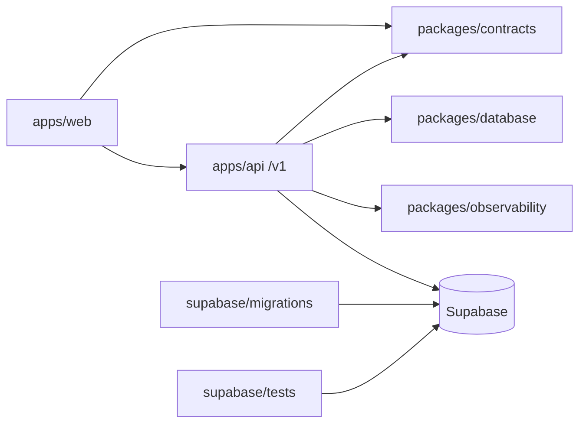

# Iatron — Repository Map

Mapa do monorepo no snapshot `8707348`. O risco considera impacto de uma
alteração: baixo, médio, alto ou crítico.

## Visão geral

| Caminho                                          | Responsabilidade e entradas                                               | Contratos/dependências                                           | Testes                    | Risco   |
| ------------------------------------------------ | ------------------------------------------------------------------------- | ---------------------------------------------------------------- | ------------------------- | ------- |
| `apps/web`                                       | Next.js App Router; entrada `src/app`; apresentação dos quatro workspaces | contracts, ui, Supabase SSR, API `/v1`                           | Vitest, `e2e`, `e2e-auth` | alto    |
| `apps/api`                                       | Fastify; `src/main.ts`, `src/app.ts`, rotas/repositórios por domínio      | contracts, database, observability, Supabase, OpenAI server-side | `src/*.test.ts`, `test/`  | crítico |
| `packages/contracts`                             | schemas Zod e tipos da fronteira                                          | fonte de contrato compartilhado                                  | `index.test.ts`           | alto    |
| `packages/database`                              | cliente base e tipos gerados do schema                                    | Supabase/Postgres                                                | drift no workflow         | crítico |
| `packages/ui`                                    | componentes reutilizáveis                                                 | React                                                            | testes do consumidor      | médio   |
| `packages/ai`                                    | base server-side de IA                                                    | OpenAI backend                                                   | testes de API/Tutor       | alto    |
| `packages/observability`                         | logs/telemetria base                                                      | API                                                              | testes de observabilidade | alto    |
| `packages/config`                                | configuração compartilhada                                                | TypeScript                                                       | typecheck                 | médio   |
| `packages/eslint-config`                         | lint comum                                                                | ESLint                                                           | `pnpm lint`               | médio   |
| `packages/typescript-config`                     | strict configs                                                            | TypeScript                                                       | `pnpm typecheck`          | médio   |
| `supabase/migrations`                            | schema, constraints, funções, grants e RLS                                | 30 migrations versionadas                                        | pgTAP + reset             | crítico |
| `supabase/seeds`, `seed.sql`, `seed.staging.sql` | dados técnicos/fictícios e piloto                                         | schema atual                                                     | CI/smoke                  | alto    |
| `supabase/tests/database`                        | pgTAP de domínio e RLS                                                    | Supabase local/remoto                                            | `pnpm db:test*`           | crítico |
| `scripts`                                        | guards cloud, banco, importação, alinhamento e E2E                        | CLIs e env                                                       | testes Node               | alto    |
| `.github/workflows`                              | CI, staging, E2E e produção                                               | GitHub Environments/WIF                                          | execução Actions          | crítico |
| `infra/gcp`                                      | bootstrap e Cloud Build da API                                            | GCP/Artifact Registry                                            | deploy/smoke              | crítico |
| `docs/adr`                                       | ADRs `0001`–`0014`                                                        | decisões arquiteturais                                           | revisão                   | alto    |
| `docs/product`                                   | governança e estado do produto                                            | obrigatório antes de agir                                        | revisão                   | alto    |
| `docs`                                           | operação e documentação dos domínios                                      | código/workflows                                                 | revisão                   | médio   |

## Localização por domínio

| Domínio             | Web                                                                     | API/contratos                                     | Banco/políticas                                                                |
| ------------------- | ----------------------------------------------------------------------- | ------------------------------------------------- | ------------------------------------------------------------------------------ |
| Autenticação/sessão | `apps/web/src/lib/auth.ts`, `(public)/auth`, login/cadastro/recuperação | `apps/api/src/auth.ts`, `me-routes.ts`            | migrations de identity/profile, RLS                                            |
| RBAC                | layouts e guards de `/app`, `/review`, `/editorial`, `/admin`           | `auth.ts`, rotas admin/editorial                  | roles/policies nas migrations                                                  |
| RLS                 | consumo SSR sem privilégio                                              | repositórios com JWT/service role restrita        | migrations + `supabase/tests/database/rls.test.sql`                            |
| Student             | `app/(authenticated)/app`, `features/journey`                           | student, learning, assessment, plan, tutor routes | tabelas/eventos do estudante                                                   |
| Mentor              | `app/review`, `features/mentors`, editorial compartilhado               | `editorial-routes/repository`                     | ownership/review migrations                                                    |
| Editorial           | `app/editorial`, `features/editorial`                                   | `editorial-routes/repository`, email              | editorial intelligence/RLS                                                     |
| Admin               | `app/admin`, `features/admin`                                           | `admin-routes/repository`                         | audit, roles, admin functions/policies                                         |
| Diagnóstico         | `app/.../assessment`, `features/assessments`                            | `assessment-*`                                    | adaptive/diagnostic migrations e pgTAP                                         |
| Plano               | `app/.../plan`, `features/study-plans`                                  | `study-plan-*`                                    | adaptive plan migrations/test                                                  |
| Simulados           | `app/.../simulations`; jornada marca `upcoming`                         | evento `SimulationFinished`, sem engine integrada | sem fluxo completo identificado                                                |
| Tutor               | `app/.../tutor`, `features/tutor`                                       | `tutor-routes/repository`, `packages/ai`          | conversation/tutor migrations/test                                             |
| Learning            | `features/learning`, páginas learning/performance                       | `learning-*`, `learning-dna-*`                    | learning engine/DNA migrations/test                                            |
| Conteúdo/questões   | academic/editorial/library                                              | academic/editorial/exam-intelligence              | academic/content/exam migrations                                               |
| Competências        | rotas academic, review, editorial e admin                               | contratos academic/editorial                      | taxonomy, knowledge ownership                                                  |
| Referências         | workspaces editorial/mentor                                             | editorial/academic repositories                   | guidelines/references/content versions                                         |
| Ownership           | mentor/editorial/admin specialty pages                                  | editorial/admin repositories                      | `202607260001`, `202607270001`                                                 |
| Observabilidade     | metadados no Executive Console                                          | `observability.ts`, operations/meta               | audit/event tables                                                             |
| Aptidão             | nenhuma UI específica localizada                                        | elegibilidade diagnóstica no assessment/editorial | `diagnostic_question_eligibility`; não equivale a política configurável do MVP |

## Entradas de execução

- Web: `apps/web/package.json`, `apps/web/src/app`.
- API: `apps/api/src/main.ts`, Dockerfile multi-stage, porta `PORT`.
- Contrato: `packages/contracts/src/index.ts`.
- Schema: ordem lexicográfica de `supabase/migrations/*.sql`.
- CI: `.github/workflows/ci.yml`.
- Staging: `deploy-supabase-staging.yml` → `deploy-api-staging.yml` →
  integração Git da Vercel → `e2e-staging.yml`.
- Produção: `deploy-production.yml`, somente manual e confirmado.

## Regras para alteração

- Não introduzir regra de domínio na web.
- Não editar tipos gerados manualmente; use o script de tipos.
- Migration é forward-only, pequena, indexada, com constraints/RLS e pgTAP.
- Contrato muda antes ou junto de produtor e consumidor, preservando compatibilidade.
- Mudança de fronteira de plataforma requer ADR.
- Mudança em conteúdo/mentor/prova exige governança editorial e Decision Register.
